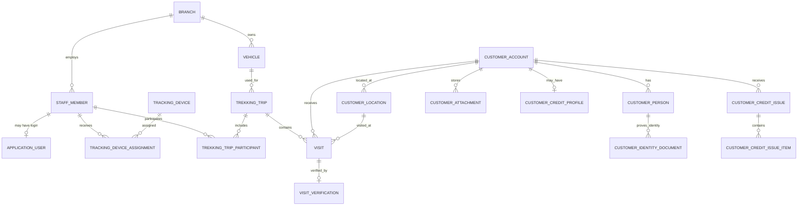

# Proh Pharmacy Trekking Backend Requirements

**Document status:** Draft for review  
**Version:** 0.1  
**Last updated:** 5 September 2026  
**Backend platform:** ASP.NET Core / C#  

## 1. Purpose

Proh Pharmacy operates trekking vans that visit pharmacies and other customers across multiple regions of Ghana. The backend will support staff onboarding, trekking assignments, vehicle and driver management, customer registration, customer-location verification, field visits, Traccar-based driver tracking, and limited tracking of goods supplied on credit or loan.

The system must help management answer:

1. Which staff, driver, vehicle and tracking device are assigned to a trek?
2. Where is an active trekking team, and when was it last seen?
3. Where is each customer physically located?
4. Which customers were visited, by whom and when?
5. Can a visit be verified using PWA and Traccar location evidence?
6. Who is responsible for a customer account that receives goods on credit?
7. Which goods or values remain outstanding for that customer?
8. Which field records are waiting to synchronize?

## 2. Product boundary

### 2.1 Included in the first backend

- Staff onboarding and application-user invitations
- Basic role-based and branch-scoped authorization
- Branch, Ghana location, vehicle and tracking-device setup
- Historical assignment of phones/tracking devices to drivers
- Planning, starting, monitoring and completing trekking trips
- Traccar integration for live and historical locations
- Customer business registration
- Responsible-person, proprietor, guarantor and identity records
- Customer portrait, Ghana Card evidence and premises photographs
- Customer physical-location capture and verification
- Customer visit check-in, check-out, notes and evidence
- Basic credit profile and records of goods issued on credit/loan
- Offline PWA synchronization
- Audit trail, alerts and operational reports
- CSV/Excel export

### 2.2 Outside the first backend

- Full inventory management
- Full sales-order and invoicing system
- General ledger or complete accounting system
- Route optimization
- Customer e-commerce portal
- Automated facial recognition or biometric matching
- Replacement of Traccar as the GPS tracking platform
- Automatic Ghana Card verification until Proh Pharmacy is onboarded to the official NIA verification service

## 3. Assumptions

- The field interface will be an installable PWA.
- Traccar Client will be installed on each driver's mobile device and will report to a Traccar server.
- The PWA and Traccar Client may operate on the same phone, but they remain separate applications.
- Traccar is the source of truth for raw continuous location history.
- The Proh backend is the source of truth for staff, vehicles, treks, customers, visits, credit context and authorization.
- A driver, phone or vehicle may be reassigned; historical assignments must remain intact.
- A customer may be a business while the person legally or operationally responsible for the credit is an individual.
- A customer may have more than one location or responsible person.
- Full sales and accounting may remain in Proh Pharmacy's existing accounting system.

## 4. Recommended technical architecture

- .NET 10 LTS ASP.NET Core Web API
- PostgreSQL
- Entity Framework Core
- ASP.NET Core Identity
- JWT access tokens and rotating refresh tokens
- Policy-based authorization
- SignalR for live management-dashboard updates
- A hosted background service or Hangfire for Traccar ingestion, reconciliation and alerts
- S3-compatible private object storage for photographs and documents
- OpenAPI/Swagger
- Docker deployment
- Modular-monolith structure

Suggested application modules:

```text
Identity
Organisation
Staff
Fleet
Tracking
Trekking
Customers
CustomerKyc
CustomerCredit
Visits
OfflineSync
Reporting
Auditing
Notifications
```

## 5. Users, staff and access control

### 5.1 Staff member

A `StaffMember` represents a worker. It is separate from `ApplicationUser` because a staff record may exist without application access.

Required fields:

- `Id`
- `EmployeeNumber`
- `FirstName`
- `LastName`
- `PhoneNumber`
- `EmailAddress`
- `JobTitle`
- `BranchId`
- `EmploymentStatus`
- `JoinedOn`
- `ProfilePhotoObjectKey` (optional)
- `CreatedAt`
- `CreatedBy`
- `UpdatedAt`
- `RowVersion`

Staff status values:

```text
Pending
Active
Suspended
Offboarded
```

### 5.2 Application user

- An administrator creates a staff record.
- The administrator optionally grants application access.
- The system sends an invitation with a short-lived token.
- The staff member creates an initial password.
- Administrators can suspend access and revoke sessions.
- Offboarding must disable access without deleting operational history.
- Public self-registration is not allowed.

### 5.3 Initial roles

| Role | Main access |
| --- | --- |
| Super Admin | All system configuration and records |
| Operations Manager | All trekking operations, fleet, customers and reports |
| Branch Manager | Staff, vehicles, treks and customers for one or more assigned branches |
| Field Staff | Assigned treks, customer registration and visit capture |
| Driver | Assigned treks and personal tracking-device status |
| Credit Officer | Customer KYC, credit assessment and outstanding credit records |
| Auditor | Read-only reports and audit events |

Suggested permissions:

```text
Staff.View
Staff.Manage
Roles.Manage
Branches.Manage
Vehicles.Manage
TrackingDevices.Manage
Treks.ViewAll
Treks.Create
Treks.Assign
Treks.Start
Treks.Complete
Customers.Register
Customers.Edit
Customers.Approve
CustomerKyc.View
CustomerKyc.Manage
CustomerCredit.View
CustomerCredit.Manage
Visits.Record
Visits.Verify
Tracking.ViewAll
Reports.Export
Audit.View
```

Authorization must combine permissions with resource scope. For example, a branch manager may have `Customers.Edit` but only for customers owned by that manager's branch.

## 6. Organisation and location setup

### 6.1 Branch

- `Id`
- `Code`
- `Name`
- `BranchType`: `Retail`, `Wholesale`, or `Laboratory`
- `RegionId`
- `DistrictId`
- `LocalityId`
- `Address`
- `Latitude`
- `Longitude`
- `ContactNumber`
- `IsActive`

### 6.2 Ghana location hierarchy

The backend will maintain offline-friendly reference data:

```text
Region -> District -> Locality/Town
```

The PWA will periodically download the current active dataset. Manual location selection is a fallback and does not count as GPS verification.

## 7. Fleet and tracking-device setup

### 7.1 Vehicle

- `Id`
- `RegistrationNumber`
- `DisplayName`
- `Make`
- `Model`
- `Year`
- `Colour`
- `BranchId`
- `OperationalStatus`
- `Notes`
- `RowVersion`

Vehicle status values:

```text
Available
Assigned
UnderMaintenance
Inactive
```

### 7.2 Tracking device

A `TrackingDevice` represents the driver's mobile device registered in Traccar.

- `Id`
- `TraccarDeviceId`
- `TraccarUniqueId`
- `Name`
- `PhoneDescription`
- `PhoneNumber` (optional)
- `LastReportedAt`
- `LastLatitude`
- `LastLongitude`
- `LastAccuracy`
- `TrackingStatus`
- `IsActive`

### 7.3 Driver-device assignment

Do not store only a current `DriverId` on the tracking device. Use assignment history:

```text
TrackingDeviceAssignment
- Id
- TrackingDeviceId
- StaffMemberId
- AssignedFrom
- AssignedUntil
- AssignedBy
- Status
```

Only one active staff assignment is allowed for a tracking device. A staff member may not have two active tracking-device assignments unless a manager explicitly approves an exceptional case.

## 8. Trekking-trip management

### 8.1 Trekking trip

- `Id`
- `TrekNumber`
- `BranchId`
- `TerritoryName`
- `RegionId`
- `ScheduledDate`
- `VehicleId`
- `DriverStaffId`
- `TrackingDeviceId`
- `PlannedStartAt`
- `ActualStartAt`
- `PlannedEndAt`
- `ActualEndAt`
- `StartOdometer` (optional)
- `EndOdometer` (optional)
- `Status`
- `Notes`
- `CreatedBy`
- `ApprovedBy` (optional)
- `RowVersion`

Statuses:

```text
Draft
Scheduled
Ready
InProgress
Completed
Cancelled
```

### 8.2 Trek participants

`TrekkingTripParticipant` will support multiple field staff:

- `TrekkingTripId`
- `StaffMemberId`
- `ParticipantRole`: `Driver`, `SalesRepresentative`, or `Supervisor`

### 8.3 Trek business rules

- A trek has one vehicle and exactly one driver.
- A trek may have multiple field representatives.
- The driver must have an active Traccar device assignment.
- A driver, vehicle or tracking device may not be attached to two simultaneous active treks.
- Starting a trek checks that the tracking device has reported within a configurable period.
- A stale tracker produces a warning and may require a manager override.
- Completed treks are read-only.
- Reopening a completed trek requires a reason and an audit event.

## 9. Customer account model

The customer domain must not be stored as one large table. It will be separated into the business account, people, locations, identity documents, photographs and credit records.

### 9.1 Customer account

Represents the pharmacy, shop, clinic, hospital, wholesaler or other business receiving goods.

- `Id`
- `CustomerCode`
- `BusinessName`
- `TradingName` (optional)
- `CustomerTypeId`
- `BusinessRegistrationNumber` (optional)
- `TaxIdentificationNumber` (optional)
- `PharmacyOrRegulatoryLicenceNumber` (optional)
- `PrimaryPhoneNumber`
- `AlternativePhoneNumber` (optional)
- `WhatsAppNumber` (optional)
- `EmailAddress` (optional)
- `OwningBranchId`
- `RegistrationStatus`
- `RegisteredByStaffId`
- `RegisteredDuringTrekId` (optional)
- `ClientGeneratedId`
- `CreatedOffline`
- `CreatedAt`
- `UpdatedAt`
- `RowVersion`

Statuses:

```text
Draft
PendingReview
Active
Rejected
Suspended
Inactive
```

Possible initial customer types:

```text
RetailPharmacy
WholesalePharmacy
OTCMedicineSeller
Clinic
Hospital
ChemicalShop
LicensedHealthFacility
Other
```

### 9.2 Customer responsible person

A business can have several related individuals. Use `CustomerPerson` rather than placing one person's biodata directly on `CustomerAccount`.

- `Id`
- `CustomerAccountId`
- `RelationshipType`
- `FirstName`
- `MiddleName` (optional)
- `LastName`
- `DateOfBirth` (only when approved as necessary)
- `Sex` (only when approved as necessary)
- `PrimaryPhoneNumber`
- `AlternativePhoneNumber` (optional)
- `EmailAddress` (optional)
- `ResidentialAddress`
- `Occupation` (optional)
- `IsPrimaryContact`
- `IsCreditResponsiblePerson`
- `IsActive`

Relationship types:

```text
Owner
Proprietor
Director
Manager
PrimaryContact
CreditResponsiblePerson
Guarantor
Other
```

### 9.3 Identity documents and KYC

`CustomerIdentityDocument` fields:

- `Id`
- `CustomerPersonId`
- `DocumentType`: initially `GhanaCard`
- `DocumentNumberEncrypted`
- `DocumentNumberLookupHash`
- `MaskedDocumentNumber`
- `ExpiryDate` (if applicable)
- `FrontImageObjectKey`
- `BackImageObjectKey`
- `VerificationStatus`
- `VerificationMethod`
- `VerifiedAt` (optional)
- `VerifiedBy` (optional)
- `ConsentRecordId`
- `CreatedAt`

Verification statuses:

```text
Unverified
PendingVerification
VisuallyInspected
NiaVerified
Rejected
Expired
```

Requirements:

- Never store the full Ghana Card number in logs, URLs, analytics or audit-value payloads.
- Encrypt the full number at application level with the encryption key kept outside the database.
- Use an HMAC-based lookup value for exact duplicate detection.
- Display only a masked number to ordinary authorized users.
- Record every view or download of Ghana Card images.
- Store document images privately and return only short-lived authorized download URLs.
- Physical inspection or an uploaded image must not be described as official identity verification.
- When official verification is required, integrate with the NIA Identity Verification System after institutional onboarding.

### 9.4 Customer photographs and documents

`CustomerAttachment` types:

```text
CustomerPortrait
GhanaCardFront
GhanaCardBack
BusinessPremisesFront
BusinessPremisesInterior
BusinessRegistrationDocument
BusinessLicenceDocument
CreditAgreement
GuarantorDocument
Other
```

Attachment metadata:

- `CustomerAccountId`
- `CustomerPersonId` (optional)
- `AttachmentType`
- `ObjectKey`
- `ContentType`
- `FileSize`
- `CapturedAt`
- `CapturedByStaffId`
- `CaptureLatitude` and `CaptureLongitude` (optional)
- `UploadedAt`
- `MalwareScanStatus`
- `RetentionUntil` (optional)

## 10. Customer location tracking

Customer location is a core domain, not just text fields on the customer.

### 10.1 Customer location

- `Id`
- `CustomerAccountId`
- `LocationType`: `BusinessPremises`, `DeliveryLocation`, `Residential`, or `Other`
- `RegionId`
- `DistrictId`
- `LocalityId`
- `DigitalAddress` (optional)
- `StreetAddress` (optional)
- `LandmarkAndDirections`
- `Latitude` (optional for manual records)
- `Longitude` (optional for manual records)
- `AccuracyMetres` (optional)
- `CaptureMethod`
- `CapturedAt`
- `CapturedByStaffId`
- `CapturedDuringTrekId` (optional)
- `VerificationStatus`
- `VerifiedAt` (optional)
- `VerifiedByStaffId` (optional)
- `IsPrimary`
- `ValidFrom`
- `ValidUntil` (optional)

Capture methods:

```text
PwaGps
ManualLocationSelection
MapPinCorrection
ManagerCorrection
Imported
```

Verification statuses:

```text
Unverified
GpsCaptured
ConfirmedByRepeatVisit
ManagerVerified
Disputed
Superseded
```

### 10.2 Location rules

- Preserve previous locations when a customer relocates.
- Only one current primary business location is allowed.
- Store GPS accuracy and capture time with the coordinates.
- Manual location selection cannot be reported as GPS verified.
- A later verified visit may confirm an existing location.
- Moving a customer's primary map position requires an audit event.
- Duplicate detection should consider similar names, matching phone numbers and nearby coordinates.

## 11. Credit and goods supplied on loan

The first backend will capture enough credit information to identify responsible persons and track exposure. It will not replace full accounting unless that scope is approved later.

### 11.1 Customer credit profile

- `Id`
- `CustomerAccountId`
- `CreditStatus`
- `RequestedCreditLimit`
- `ApprovedCreditLimit`
- `PaymentTermDays`
- `RiskRating`
- `AssessmentNotes`
- `ApprovedBy`
- `ApprovedAt`
- `SuspendedAt` (optional)
- `SuspensionReason` (optional)
- `RowVersion`

Credit statuses:

```text
NotRequested
PendingAssessment
Approved
Suspended
Rejected
Closed
```

### 11.2 Guarantor

A guarantor is stored as a `CustomerPerson` with relationship type `Guarantor`. The system must record:

- Which credit profile the guarantor supports
- Guarantee start and end date
- Guaranteed amount, if applicable
- Signed agreement attachment
- Verification status

### 11.3 Credit issue / loaned goods record

`CustomerCreditIssue` fields:

- `Id`
- `CustomerAccountId`
- `TrekkingTripId` (optional)
- `VisitId` (optional)
- `ExternalAccountingReference` (optional)
- `DocumentNumber`
- `IssuedAt`
- `DueAt`
- `Currency`
- `TotalValue`
- `OutstandingValue`
- `Status`
- `Notes`
- `RecordedByStaffId`
- `ApprovedByStaffId` (optional)
- `RowVersion`

`CustomerCreditIssueItem` fields:

- `CustomerCreditIssueId`
- `ExternalProductId` (optional)
- `Sku` (optional)
- `ItemDescription`
- `Quantity`
- `UnitValue`
- `TotalValue`

Credit issue statuses:

```text
Draft
Issued
PartiallySettled
Settled
Overdue
WrittenOff
Cancelled
```

### 11.4 Settlement reference

If settlements must be recorded before accounting integration is available, capture:

- `CustomerCreditIssueId`
- `Amount`
- `ReceivedAt`
- `PaymentMethod`
- `ExternalAccountingReference`
- `RecordedByStaffId`
- `Notes`

This is an operational record, not a general ledger entry. Accounting remains authoritative after integration.

### 11.5 Credit rules

- A credit account cannot be approved without an active primary customer location.
- At least one verified credit-responsible person is required.
- Ghana Card requirements must follow Proh Pharmacy's approved policy and official verification process.
- Credit above a configurable threshold may require a guarantor and manager approval.
- The system must warn when a new issue would exceed the approved credit limit.
- Suspended customers cannot receive new credit.
- Credit records cannot be hard-deleted after issue; corrections use cancellation or adjustment with reasons.

## 12. Customer visits

### 12.1 Visit

- `Id`
- `ClientGeneratedId`
- `TrekkingTripId`
- `CustomerAccountId`
- `CustomerLocationId`
- `FieldStaffId`
- `VisitType`
- `CheckInAtDevice`
- `CheckInAtServer`
- `CheckOutAtDevice` (optional)
- `CheckOutAtServer` (optional)
- `CheckInLatitude`
- `CheckInLongitude`
- `CheckInAccuracyMetres`
- `CheckOutLatitude` (optional)
- `CheckOutLongitude` (optional)
- `Outcome`
- `Notes`
- `VerificationStatus`
- `CreatedOffline`
- `SyncedAt`

Visit types:

```text
Scheduled
Unscheduled
CustomerRegistration
CreditAssessment
CreditCollection
Delivery
FollowUp
Other
```

### 12.2 Visit verification

At check-in, the backend should:

1. Receive PWA coordinates, accuracy and device time.
2. Compare the PWA coordinates with the selected customer location.
3. Find the closest Traccar position for the assigned driver's device around the check-in time.
4. Calculate PWA-to-customer and Traccar-to-customer distance.
5. Record the evidence and configured verification radius.
6. Assign a verification result.

`VisitVerification` fields:

- `VisitId`
- PWA coordinates and accuracy
- Customer coordinates
- Traccar position ID and coordinates
- Traccar position time
- PWA-to-customer distance
- Traccar-to-customer distance
- Time difference from check-in
- Allowed radius
- Verification result
- Override reason
- Reviewed by and reviewed at

Statuses:

```text
Verified
OutsideAllowedRadius
LowGpsAccuracy
NoCustomerCoordinates
NoTraccarPosition
ManualLocation
PendingReview
ManagerApproved
ManagerRejected
```

The allowed distance and Traccar time window must be configurable.

## 13. Traccar integration

Create an application boundary such as `ITrackingProvider`; domain and application modules must not depend directly on Traccar DTOs.

Required capabilities:

- Authenticate server-to-server without exposing credentials to the PWA
- Import or link existing Traccar devices
- Read device status and last-known position
- Consume live device, position and event updates
- Retrieve historical positions for a trek period
- Reconcile missed updates
- Detect stale devices
- Normalize coordinates, accuracy, timestamps, speed and heading
- Expose sanitized live updates to authorized dashboards through SignalR

Recommended usage:

- Traccar WebSocket for live updates
- Traccar REST API for device setup, history and reconciliation
- PostgreSQL or Redis for last-known-position cache
- Traccar database as the complete raw route-history source
- Proh database for visit-verification snapshots and trip/device mappings

## 14. Offline synchronization

Every offline-created aggregate must carry:

- A client-generated UUID
- Client device identifier
- Authenticated user ID
- Client-created and client-updated timestamps
- Server-received timestamp
- Entity version

Requirements:

- Repeating a mutation must not create duplicates.
- Enforce a unique idempotency key per device/user operation.
- Support batch synchronization.
- Return success or failure for each item instead of failing the entire batch.
- Process dependencies in order, such as customer, location, visit and attachments.
- Use optimistic concurrency for editable server records.
- Retain soft-deleted tombstones long enough for device synchronization.
- Upload large photographs separately and allow retries.
- The PWA must be able to display pending, synced, conflicted and failed states.

Suggested endpoint:

```http
POST /api/v1/sync/batch
```

## 15. Audit and security

Audit at minimum:

- Staff activation, suspension and offboarding
- Role and permission changes
- Device-driver and vehicle-trip reassignments
- Trek start, completion, cancellation and reopening
- Customer approval, rejection and location changes
- Access to Ghana Card data or images
- Identity verification result changes
- Credit approval, suspension, issue, settlement and write-off
- Visit-verification overrides
- Reports and KYC-document exports
- Security-sensitive configuration changes

Security requirements:

- HTTPS only
- Short-lived access tokens and rotating refresh tokens
- Immediate refresh-token revocation on suspension or offboarding
- Rate limiting on authentication and sensitive search endpoints
- Encryption of secrets and sensitive identity values
- Private document storage with short-lived authorized URLs
- Malware scanning for uploaded documents
- Database backups and tested restoration process
- Structured logs without Ghana Card numbers, passwords or document URLs
- Branch and role access checks on every customer/KYC/credit query
- Optional MFA initially; required for high-privilege roles before production approval
- UTC timestamps; display using the configured business timezone

## 16. Notifications and operational alerts

- Tracking device has not reported within the configured threshold
- Driver starts a trek without healthy tracking
- Trek remains active beyond planned end time
- Visit requires verification review
- Customer registration requires approval
- Credit assessment requires approval
- Credit issue is due soon or overdue
- Credit limit has been reached or exceeded
- Offline records have repeatedly failed to synchronize

## 17. Reports

- Active and completed treks
- Live and last-known driver locations
- Tracking devices and last-seen status
- Trek route and duration
- Customers by region, district, locality, branch and registration status
- Customer map and location-verification status
- New customers registered by staff and trek
- Customer visit history
- Verified and unverified visits
- Credit customers and responsible persons
- Credit limit, issued value, outstanding value and overdue records
- Customer KYC completion status without exposing full Ghana Card numbers
- Audit report
- CSV/Excel exports subject to permission and audit

## 18. Initial API surface

```text
/api/v1/auth
/api/v1/invitations
/api/v1/users
/api/v1/staff
/api/v1/roles
/api/v1/branches
/api/v1/locations
/api/v1/vehicles
/api/v1/tracking-devices
/api/v1/device-assignments
/api/v1/treks
/api/v1/treks/{id}/participants
/api/v1/treks/{id}/start
/api/v1/treks/{id}/complete
/api/v1/customers
/api/v1/customers/{id}/people
/api/v1/customers/{id}/locations
/api/v1/customers/{id}/attachments
/api/v1/customer-people/{id}/identity-documents
/api/v1/customers/{id}/credit-profile
/api/v1/customers/{id}/credit-issues
/api/v1/credit-issues/{id}/settlements
/api/v1/visits
/api/v1/visits/{id}/check-in
/api/v1/visits/{id}/check-out
/api/v1/visits/{id}/verification
/api/v1/tracking/live
/api/v1/tracking/history
/api/v1/sync/batch
/api/v1/reports
/api/v1/audit
```

## 19. Core entity relationship overview



## 20. MVP acceptance criteria

The initial backend is operational when:

1. An administrator can onboard staff and grant scoped application access.
2. A manager can register a vehicle and link an existing Traccar device.
3. A manager can assign the device to a driver without losing earlier assignment history.
4. A manager can schedule a trek with a vehicle, driver and field staff.
5. The backend validates tracker health before allowing the trek to start.
6. Authorized management users receive live or last-known locations.
7. Field staff can register a customer business, responsible person and physical location offline.
8. Authorized staff can securely capture customer portraits and Ghana Card evidence.
9. A customer visit can be checked in and compared with both the registered customer location and Traccar evidence.
10. A manager can review location or visit exceptions.
11. A credit officer can approve a credit profile and record goods issued on credit/loan.
12. The system warns when a credit limit would be exceeded or a record becomes overdue.
13. Repeated offline synchronization does not create duplicate customers, visits or credit issues.
14. Sensitive access and operational changes appear in an immutable audit trail.

## 21. Recommended implementation order

1. Solution structure, shared kernel, PostgreSQL and migrations
2. Identity, staff invitation and RBAC
3. Branch and Ghana location reference data
4. Vehicles, tracking devices and assignment history
5. Traccar adapter, live ingestion and tracker-health status
6. Trek planning, assignment, start and completion
7. Customer account, people and location registration
8. Private attachments, KYC access controls and consent records
9. Visits and location verification
10. Offline synchronization and idempotency
11. Customer credit profiles and goods-issued records
12. Alerts, reporting, export and audit hardening
13. Security review, data-protection review, load testing and pilot rollout

## 22. Decisions requiring Proh Pharmacy approval

- Exact customer types
- Whether customer registration requires manager approval
- Which individuals require Ghana Card evidence: owner, proprietor, guarantor or all
- Whether a live customer portrait is mandatory
- Whether front and back Ghana Card images will be stored
- Official retention period for identity images and credit documents
- Who may view identity documents and full numbers
- Whether Proh Pharmacy is registered as required with Ghana's Data Protection Commission
- Whether Proh Pharmacy will onboard to NIA's Identity Verification System
- Minimum GPS accuracy and visit-verification radius
- Maximum time difference allowed between PWA check-in and Traccar evidence
- Credit approval thresholds and required approvers
- When a guarantor is mandatory
- Whether the existing accounting system or Proh backend is authoritative for outstanding balances
- Required accounting export columns or API contract
- Whether payments/settlements belong in this MVP

## 23. Privacy and identity-verification note

Customer portraits, Ghana Card details, location history and credit information are personal data. Proh Pharmacy should confirm its data-controller or processor obligations, approved collection purpose, consent or other lawful basis, retention schedule, subject-access procedure and breach-response process before production use.

The National Identification Authority states that institutions using the Ghana Card for identity verification should onboard to the official NIA Identity Verification System Platform. Physical inspection or photocopying alone should not be treated as secure authentication.

Official references:

- [Ghana Data Protection Commission registration](https://dataprotection.org.gh/registration/)
- [Ghana Data Protection Act, 2012 (Act 843)](https://dataprotection.org.gh/wp-content/uploads/2025/05/data-protection-act-2012-act-843.pdf)
- [NIA Identity Verification Services](https://nia.gov.gh/service/verification-services/)
- [NIA guidance on authentic Ghana Card verification](https://nia.gov.gh/institutions-urged-to-use-nia-ivsp-for-authentic-ghana-card-verification/)
- [Traccar API documentation](https://www.traccar.org/traccar-api/)
- [.NET releases and support](https://learn.microsoft.com/en-us/dotnet/core/releases-and-support)

## 24. Change log

| Version | Date | Change |
| --- | --- | --- |
| 0.1 | 5 September 2026 | Initial consolidated backend requirements, including customer location, KYC and credit/loan requirements |